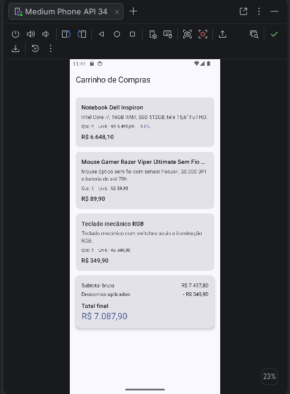
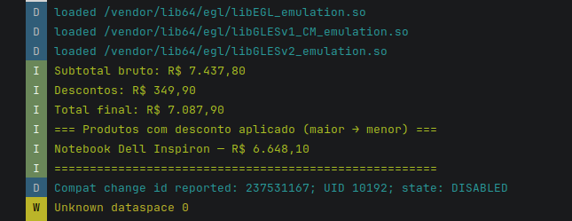

# Calculadora de Carrinho de Compras

Atividade 1 da disciplina **PDMII (Programação para Dispositivos Móveis II)** — FATEC Registro.

**Aluno:** Paulo Seiji Yamamoto Junior
**Repositório:** https://github.com/Psyj1/calculadora-compras

---

## Sobre

App Android nativo em **Jetpack Compose + Material 3** que simula um carrinho de compras:
carrega um catálogo fixo de produtos, aplica descontos, exibe a lista na tela e gera um
relatório formatado no Logcat.

## Screenshots

### Tela do app (emulador)



### Logcat — relatório dos produtos com desconto



## Arquitetura

```
app/src/main/java/com/example/calculadoracarrinho/
├── model/
│   ├── Pagavel.kt           # interface — contrato de cálculo do valor total
│   ├── Produto.kt           # nome, preço, descrição (nullable), desconto
│   └── ItemCarrinho.kt      # produto + quantidade
├── data/
│   └── Catalogo.kt          # catálogo fixo + carrinho de validação
├── domain/
│   ├── Formatador.kt        # Double.emReais() — formata em R$
│   └── RelatorioCarrinho.kt # funções puras + relatório no Logcat
└── ui/
    ├── components/
    │   ├── LinhaProduto.kt  # componente parametrizado da linha
    │   └── CardResumo.kt    # card com subtotal/descontos/total
    ├── screens/
    │   └── CarrinhoScreen.kt# tela completa (Scaffold + LazyColumn)
    └── theme/               # Material 3 (padrão do Android Studio)
```

### Decisões

- **`Pagavel`** é uma interface para que qualquer entidade com valor total (Produto, ItemCarrinho) implemente o mesmo contrato.
- **Lógica de domínio** fica em funções puras em `domain/`, sem dependência do Compose — testável isoladamente.
- **`LinhaProduto`** recebe todas as informações via parâmetro (nada de produto fixo dentro do componente).
- **`LazyColumn` + `items()`** para renderizar a lista (composição preguiçosa).
- **Tipografia** toda via `MaterialTheme.typography` (sem `fontSize` manual).
- **Descrição nula** tratada com `?: "Sem descrição"` (sem `!!`).

## Regras de negócio

- Preço final = `preco * (1 - descontoPercentual / 100)`
- Subtotal bruto = soma de `preco * quantidade`
- Total de descontos = soma de `(preco - precoComDesconto) * quantidade`
- Total final = subtotal bruto − descontos

## Relatório no Logcat

Filtro: **`Carrinho`**. Saída esperada:

```
Subtotal bruto: R$ 7.437,80
Descontos:      R$ 349,90
Total final:    R$ 7.087,90

=== Produtos com desconto aplicado (maior → menor) ===
Notebook Dell Inspiron — R$ 6.648,10
======================================================
```

## Cenário de validação (PDF)

| Produto                    | Unitário    | Desconto | Qtd |
|----------------------------|-------------|----------|-----|
| Notebook Dell Inspiron     | R$ 3.499,00 | 5%       | 2   |
| Mouse sem fio              | R$ 89,90    | 0%       | 1   |
| Teclado mecânico RGB       | R$ 349,90   | 0%       | 1   |

| Resumo              | Valor        |
|---------------------|--------------|
| Subtotal bruto      | R$ 7.437,80  |
| Descontos aplicados | R$ 349,90    |
| **Total final**     | **R$ 7.087,90** |

## Vídeo de apresentação

[Link do YouTube](https://youtu.be/-0BU6gMH9Hw) *(Não Listado)*

## Como rodar

1. Clonar: `git clone git@github.com:Psyj1/calculadora-compras.git`
2. Abrir no Android Studio (a pasta raiz, a que tem `settings.gradle.kts`)
3. Rodar em um emulador (Pixel 7 / API 34+) ou dispositivo físico
4. Abrir o Logcat e filtrar por `Carrinho`
